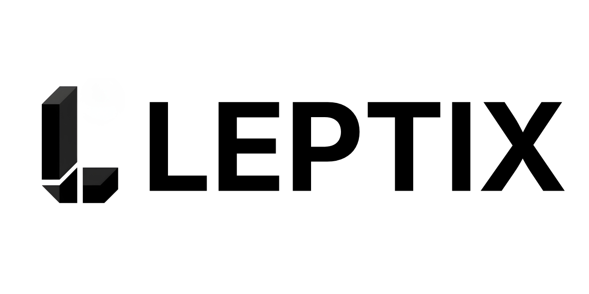

<p align="center">
  
</p>

<p align="center">
  <strong>Radix-quality accessible UI primitives for <a href="https://leptos.dev/">Leptos</a></strong>
</p>

<p align="center">
  <a href="https://crates.io/crates/leptix-ui"></a>
  <a href="https://docs.rs/leptix-ui"></a>
  <a href="LICENSE"></a>
  <a href="https://leptos.dev/"></a>
</p>

<p align="center">
  Ship accessible, unstyled components without fighting your design system.<br/>
  33 primitives. Full keyboard navigation. WAI-ARIA compliant. Zero opinions on styling.
</p>

---

## Why Leptix?

Building accessible UI in Rust/WASM is hard. You need focus trapping, keyboard navigation, screen reader support, portal rendering, and collision-aware positioning -- all while keeping components unstyled so they fit any design system.

Leptix gives you all of that out of the box, with an API that mirrors [Radix UI](https://www.radix-ui.com/primitives) -- the gold standard for accessible React primitives.

```rust
use leptix_ui::dialog::*;

#[component]
fn App() -> impl IntoView {
    view! {
        <Dialog>
            <DialogTrigger>"Open"</DialogTrigger>
            <DialogPortal>
                <DialogOverlay />
                <DialogContent>
                    <DialogTitle>"Edit Profile"</DialogTitle>
                    <DialogDescription>"Make changes to your profile."</DialogDescription>
                    <DialogClose>"Save"</DialogClose>
                </DialogContent>
            </DialogPortal>
        </Dialog>
    }
}
```

## Features

<table>
<tr>
<td width="50%">

**Accessible by default**
- WAI-ARIA roles, states, and properties
- Focus trapping in dialogs
- Roving tabindex in groups
- Screen reader announcements

</td>
<td width="50%">

**Keyboard-first**
- Arrow key navigation in menus, selects, tabs
- Home/End to jump to first/last item
- Typeahead search in menus and selects
- Escape to dismiss overlays

</td>
</tr>
<tr>
<td>

**Smart positioning**
- Floating UI collision-aware placement
- Auto-flip when near viewport edges
- Portal rendering into `document.body`
- Cursor-positioned context menus

</td>
<td>

**Developer experience**
- Controlled and uncontrolled modes
- `data-state` attributes for CSS animations
- RTL/LTR directional support
- SSR-safe (guarded `web_sys` calls)

</td>
</tr>
</table>

## Installation

**Umbrella crate** -- all 33 primitives:

```toml
[dependencies]
leptix-ui = "0.1"
```

**Cherry-pick** what you need:

```toml
[dependencies]
leptix-ui = { version = "0.1", default-features = false, features = ["dialog", "tabs", "tooltip"] }
```

**Individual crates** -- minimal dependency footprint:

```toml
[dependencies]
leptix-dialog = "0.1"
leptix-tabs = "0.1"
leptix-tooltip = "0.1"
```

## Components

| | Component | Crate | Highlights |
|---|-----------|-------|------------|
| **Layout** | | | |
| | Aspect Ratio | `leptix-aspect-ratio` | CSS ratio container |
| | Separator | `leptix-separator` | Visual + semantic divider |
| | Scroll Area | `leptix-scroll-area` | Custom scrollbars, drag-to-scroll |
| | Visually Hidden | `leptix-visually-hidden` | Screen reader only content |
| **Forms** | | | |
| | Checkbox | `leptix-checkbox` | Indeterminate state, form integration |
| | Label | `leptix-label` | Accessible form labels |
| | Radio Group | `leptix-radio-group` | Single selection, roving focus |
| | Select | `leptix-select` | Dropdown with groups + typeahead |
| | Slider | `leptix-slider` | Range input, multi-thumb, invertible |
| | Switch | `leptix-switch` | Toggle switch, form control |
| | Toggle | `leptix-toggle` | Two-state button |
| | Toggle Group | `leptix-toggle-group` | Single/multiple selection set |
| | Form | `leptix-form` | Validation + accessible errors |
| | OTP Field | `leptix-otp-field` | Multi-segment OTP input |
| | Password Toggle | `leptix-password-toggle` | Show/hide password |
| **Overlays** | | | |
| | Dialog | `leptix-dialog` | Modal with focus trap + portal |
| | Alert Dialog | `leptix-alert-dialog` | Non-dismissable confirmation |
| | Popover | `leptix-popover` | Floating panel, collision-aware |
| | Tooltip | `leptix-tooltip` | Hover/focus popup, delay groups |
| | Hover Card | `leptix-hover-card` | Rich hover preview |
| | Toast | `leptix-toast` | Notifications, swipe-to-dismiss |
| **Navigation** | | | |
| | Tabs | `leptix-tabs` | Tab panels, auto/manual activation |
| | Accordion | `leptix-accordion` | Collapsible sections |
| | Collapsible | `leptix-collapsible` | Expand/collapse with animation |
| | Navigation Menu | `leptix-navigation-menu` | Site nav with viewports |
| **Menus** | | | |
| | Dropdown Menu | `leptix-dropdown-menu` | Submenus, checkbox/radio items |
| | Context Menu | `leptix-context-menu` | Right-click, cursor-positioned |
| | Menubar | `leptix-menubar` | Horizontal menu bar |
| **Misc** | | | |
| | Avatar | `leptix-avatar` | Image loading + fallback |
| | Progress | `leptix-progress` | Determinate/indeterminate bar |
| | Toolbar | `leptix-toolbar` | Grouped controls |
| | Accessible Icon | `leptix-accessible-icon` | Icon + screen reader label |

Plus **`leptix-core`** -- the shared engine powering all primitives (Popper, Portal, Presence, FocusScope, DismissableLayer, and more).

## Architecture

```
leptix-ui                            Umbrella crate (re-exports everything)
  |
  +-- leptix-dialog                  33 primitive crates
  +-- leptix-tabs                    (independently publishable)
  +-- leptix-tooltip
  +-- leptix-select
  +-- ...
        |
        +-- leptix-core              Shared infrastructure
              |
              +-- floating-ui-leptos  Collision-aware positioning
              +-- web-sys             DOM access
              +-- leptos              Reactive framework
```

## Requirements

| | Version |
|---|---------|
| **Rust** | Nightly (edition 2024) |
| **Leptos** | 0.8+ |
| **Target** | `wasm32-unknown-unknown` |

## Built by RantAI

<p>
  Leptix is developed and maintained by <a href="https://github.com/RantAI-dev"><strong>RantAI</strong></a> -- building intelligent developer tools and open-source infrastructure for the Rust ecosystem.
</p>

## Credits

Standing on the shoulders of giants:

- **[Radix UI Primitives](https://www.radix-ui.com/primitives)** -- the reference API and behavior specification
- **[RustForWeb/radix](https://github.com/RustForWeb/radix)** -- the original Rust/Leptos port (MIT)
- **[Floating UI](https://floating-ui.com/)** -- collision-aware positioning engine
- **[Leptos](https://leptos.dev/)** -- the reactive Rust web framework

## Contributing

Contributions are welcome! Please see [CONTRIBUTING.md](CONTRIBUTING.md) for guidelines.

## License

[MIT](LICENSE) &copy; [RantAI](https://github.com/RantAI-dev)
